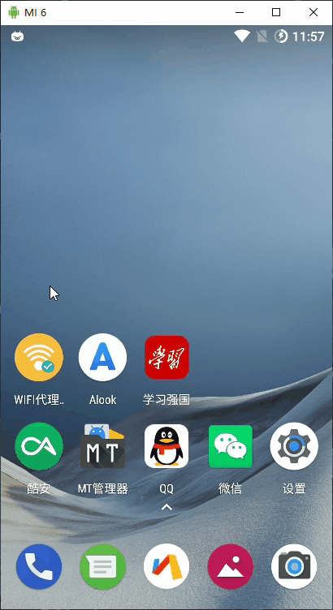

# WiFiProxyAutoSet

#### 介绍

基于Auto.js无障碍开发的安卓端一键自动设置WiFi代理的APP，配合Fiddler、Burp、Charles等抓包工具使用，懒人必备！
设备要求：Android 7.0 +  
下载地址：[WiFi代理设置_v1.0.apk](https://gitee.com/westinyang/WiFiProxyAutoSet/attach_files/437702/download)

#### 测试机型

> 目前手上的测试机这有这些，其他机型未测试，不保证都能正常使用。  
> 理论上来说只要设备设置代理过程中都包含以下字样，就没什么问题。  
> 设置 -> WLAN -> 已连接 -> 修改网络 -> 高级选项 -> [无、手动] -> 保存  

| 机型  | ROM  | Android版本  |
| ------------ | ------------ | ------------ |
| 小米 4  | 魔趣 mokee  | 7.1.2  |
| 小米 6  | 魔趣 mokee  | 7.1.2  |
| 荣耀 8 青春版  | Lineage 14.1  | 7.1.2  |
| 谷歌 Pixel  | 原生 AOSP  | 7.1.2  |
| 华为 Nova 7  | EMUI 10.1.1  | 10  |

#### 运行演示

#### 使用说明

1.  手机端安装 Auto.js + Auto.js打包插件，并启用无障碍
2.  电脑端安装 VSCode + Auto.js插件
3.  Clone项目并用VSCode打开
4.  开启服务 `Auto.js: Start Server`
5.  手机端打开Auto.js，连接电脑
6.  保存项目到手机端 `Auto.js: SaveProject`
7.  手机端打开Auto.js，找到项目，进行打包

#### 参与贡献

1.  Fork 本仓库
2.  新建 Feat_xxx 分支
3.  提交代码
4.  新建 Pull Request